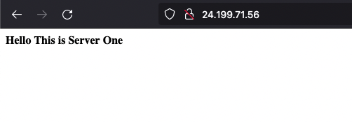
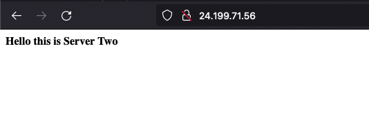

# ACIT 2420 Assignment 2
### By Aashay Bharadwaj

## Step 1
  1. Create two new droplets on Digital Ocean
  2. Create a VPC, Load Balancer and a firewall by following along the video posted in class notes.
    
## Step 2
  1. `ssh` into the newly created droplets using: `ssh -i .ssh/key_you_created root@droplet_ip`
  2. Create new users with the same username and password on both droplets.
      1. Create a new user with: `useradd -ms /bin/bash user_name`
      2. Give the user sudo privilages: `usermod -aG sudo user_name`
      3. set password using: `passwd user_name`
      
## Step 3
Install Caddy webservers on both droplets by following the steps from  ***step 5***. 
    
 ## Step 4
  1. On your host machine create a new directory called ACIT2420-Assignment2.
  2. In that directory create two more directories called html and src
  3. In the html directory create a new html document called index.html and paste this code inside it:
  ``
  
  4. In the src directory
      
     1. Open src directory in terminal and enter: `npm init`
     2. `npm i fastify`
     3. Create a new js file called index.js and enter the following code:
     ``
     4. sftp the two newly created directories to the two droplets: `sftp -i .ssh/key_name user_name@ip_address`
      
        1. Navigate to ACIT2420-Assignment2 directory using `lcd` 
        2. `put -r html`
        3. `put -r src`
        
        ***Note: `put -r src` will take some time as it will have to upload a lot of dependancies***
        
## Step 5

  1. Install Caddy using apt which will also create a caddy service file 
  2. Enter the following commands one after the other:
      
      1. `sudo apt install -y debian-keyring debian-archive-keyring apt-transport-https -y`
      2. `curl -1sLf 'https://dl.cloudsmith.io/public/caddy/stable/gpg.key' | sudo gpg --dearmor -o /usr/share/keyrings/caddy-stable-archive-keyring.gpg`
      3. `curl -1sLf 'https://dl.cloudsmith.io/public/caddy/stable/debian.deb.txt' | sudo tee /etc/apt/sources.list.d/caddy-stable.list`
      4. `sudo apt-get update`
      5. `sudo apt-get install caddy -y`
      6. `sudo systemctl enable --now caddy`
      
## Step 6

Install Node on each droplet using Volta

  `curl https://get.volta.sh | bash`
  
  `source ~/.bashrc`
  
  `volta install node`
  
## Step 7
On your host machine create a service file:
    
    [Unit]
    Description=runs a hello world webapp
    After=network-online.target
    Wants=network-online.target

    [Service]
    ExecStart=/home/user_name/.volta/bin/node /var/www/src/index.js
    User=username
    Group=username
    Restart=always
    RestartSec=10
    TimeoutStopSec=90
    SyslogIdentifier=hello_app

    [Install]
    WantedBy=multi-user.target
    
## Step 8

  1. `sftp` into both droplets and change directories to ***/etc/systemd/system***
  2. `put` the service file into this location on both droplets
  3. `start/enable` the servie file using `systemctl` command
  4. Create a user called caddy and ,ake it the owner using chown for:
    
      1. `/var/www` directory
      2. `/var/www/html/index.html` directory
      3. `/var/www/src/index.js` directory
      4. `/var/www/src` directory
    
  5. After giveing ownership enter the following commands to start the caddy service:
    
    1. systemctl daemon-reload
    2. sudo systemctl start caddy
    3. sudo systemctl enable caddy 
    
## Step 9

  1. Access the load balancers ip through a website to see the traffic balancing between the two servers. 
  
  ***My Load Balancer can be accessed through http://24.199.71.56/***

